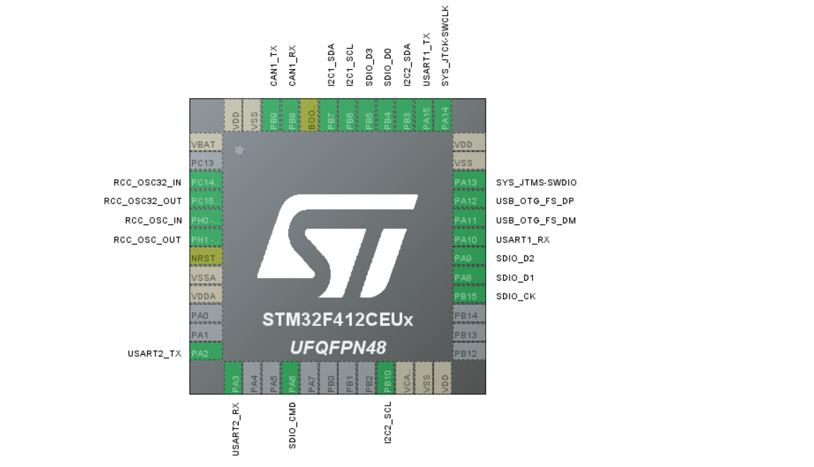

# ProIMU (Under Development)
### A high precision interial measurement unit with altitute and GPS support.

### Folders:

    📁 Documentation
    📁 Firmware
    📁 Hardware
        ↳ 📁 3D Model
        ↳ 📁 assembly_outputs
        ↳ 📁 BOM
        ↳ 📁 fab_outputs
        ↳ 📁 position_file
        ↳ 📁 footprints.pretty
        ↳ 📁 kicad_proj
            ↳ 📁 ProIMU_V1
        ↳ 📁 lib_fp.pretty
    📁 Images
    📄 README.md

### Pinout of the MCU

### Features available: 

<li>Yaw  (degrees / rad)</li>
<li>Pitch  (degrees / rad)</li>
<li>Roll   (degrees / rad)</li>
<li>Quaternions (degrees / rad)</li>
<li>Pressure (Pa / Hg)</li>
<li>Altitude </li>
<li>Temperature (C / F) </li>
<li>Longitutde </li>
<li>Lattitude </li>
<li>Raw Accelerometer, Gyroscope & Magnetometer </li>
<li>Direction (N/W/E/S) </li>

### Communication Protocols Available:

<li>CAN FD</li>
<li>RS232</li>
<li>USB</li>
<li>TCP IP Socket</li>
<li>MQTT</li>

